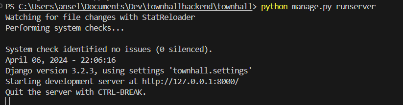

# townhallbackend
Backend Django server using DRF

Following the set up of
https://medium.com/swlh/build-your-first-rest-api-with-django-rest-framework-e394e39a482c
If you can't access the article, just follow the instructions below

Install Dependencies

Step1
First you need to install python and pip:
https://www.python.org/downloads/
https://pip.pypa.io/en/stable/installation/

Step2
Then once you have it installed, run the following command
`pip install django`

Step2.5
Run the following command to make superuser, ensure you have `cd townhall` and gone in the townhall subdirectory
`python manage.py createsuperuser`
username: townhall
pw: townhall 

Step3: run migrations
To run migrations:
`python manage.py migrate`

Step4: run the server
To run the server: 
`python manage.py runserver`

Step5: checking if server is running
To check if your server is running, navigate to http://localhost:8000/admin/ or http://localhost:8000/

Read the linked medium article or ping Ansel if there are any questions. 

If at any point you have migrations that need to be applied, run the following
`python manage.py migrate`